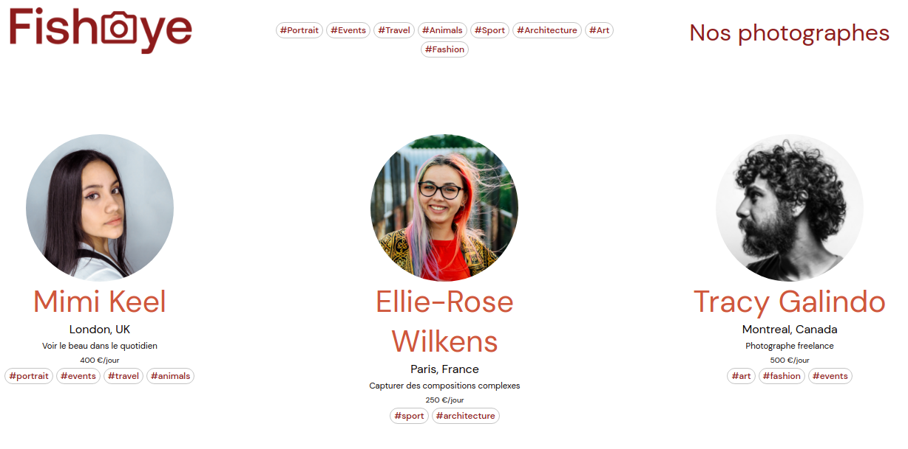

# FishEye

## Table of contents
- [Context](#context)
- [Demonstration](#demonstration)
- [What this project allowed me to practice](#what-this-project-allowed-me-to-practice)
  - [Skills](#skills)
  - [Technologies / Methosds](#technologies--methods)
- [Expected deliverables](#expected-deliverables)
  - [Home page](#home-page)
  - [Photographers page](#photographers-page)
- [Resources](#resources)
- [Technical constraints](#technical-constraints)

## Context

**FishEye** is a website that allows freelance photographers to showcase their best work.

## Demonstration

**FihEye** is visible on https://codamor.github.io/FishEye/

## What this project allowed me to practice

### Skills

* cut and integrate a model,
* structure a web page with HTML5,
* format a web page with CSS3,
* manipulate the DOM,
* listen to events,
* generate content dynamically from a JSON file,
* make the site accessible.

### Technologies / methods

* HTML5/CSS3,
* positioning with Grid and FlexBox,
* responsive design with media queries,
* BEM naming convention,
* Fetch/Json,
* CSS with Sass,
* WCAG 2.0.

## Expected deliverables

### Home page

* list of all photographers with their name, slogan, location,
  their price/hour, their tags and a thumbnail image of their choice,

* by clicking on a label (tag) in the navigation bar, the list of
  photographers is filtered to display only those who match this
  label,

* when the user clicks on a photographer's thumbnail, he is taken to his
  page.

### Photographers page

* displays a gallery of the photographer's work,

* photographers can show both photos and videos,

* each media includes the title, date, price and number of shots,
  * when the user clicks on the "Like" icon, it increments the number
    of likes displayed,
  * the total number of snaps should be counted and added to the profile total
    of the photographer,

* media can be sorted by popularity, date or title,

* when the user clicks on a media, it must open in a
  light box,

* display a button to contact the photographer
  * the contact form is a modal that is displayed over the
    rest,
  * it includes fields for names, email address and
    message,
  * later, the contact button will send a message to the photographer;
    For now, only display the contents of the three fields in
    the console logs

## Resources 

* desktop and mobile models,
* Json data file,
* photographs.

## Technical constraints

* The site had to be adapted to:
  *desktop,
  * mobiles,
  * shelves (free adaptation).

* The code should be:
  * valid to **W3C** standards,
  * compatible with the latest versions of **Chrome** and **Firefox**

